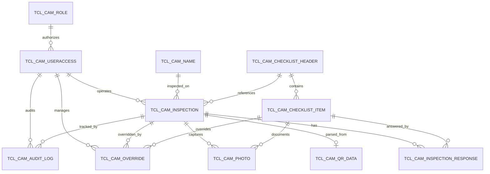

# TCL V2 Database Design — Sprint 1

## ER Diagram



## Table Inventory

| # | Table Name | V1 Predecessor | Purpose |
|---|-----------|---------------|---------|
| 1 | `tcl_cam_role` | `roles` | Role definitions |
| 2 | `tcl_cam_useraccess` | `users` | Production user master |
| 3 | `tcl_cam_name` | `machines` | Camshaft nomenclature master |
| 4 | `tcl_cam_checklist_header` | *(new)* | Checklist version/revision master |
| 5 | `tcl_cam_checklist_item` | `checklist_items` | Individual checklist items |
| 6 | `tcl_cam_inspection` | `inspections` | Inspection with progress tracking |
| 7 | `tcl_cam_qr_data` | *(new)* | Parsed QR code data |
| 8 | `tcl_cam_inspection_response` | `inspection_responses` | Per-item results |
| 9 | `tcl_cam_photo` | `photos` | BLOB photo storage |
| 10 | `tcl_cam_override` | `overrides` | Manager overrides |
| 11 | `tcl_cam_audit_log` | `audit_logs` | Partitioned audit trail |

## Schema Changes

### New Tables (V2 only)
- `tcl_cam_checklist_header` — versioned checklist master for future revisions
- `tcl_cam_qr_data` — normalized QR token storage (part_number, serial_number, vendor_code)

### Renamed Tables (V1 → V2)
- `roles` → `tcl_cam_role`
- `users` → `tcl_cam_useraccess`
- `machines` → `tcl_cam_name`
- `checklist_items` → `tcl_cam_checklist_item` (now subordinate to header)
- `inspections` → `tcl_cam_inspection`
- `inspection_responses` → `tcl_cam_inspection_response`
- `photos` → `tcl_cam_photo`
- `overrides` → `tcl_cam_override`
- `audit_logs` → `tcl_cam_audit_log`

### Critical Column Changes

#### tcl_cam_inspection (V2)
| Column | Change |
|--------|--------|
| `status` | Added `NOT_STARTED` (was: `IN_PROGRESS`, `SUBMITTED`, `APPROVED`, `REJECTED`) |
| `current_step` | NEW — tracks which checklist item operator is on |
| `completion_pct` | NEW — auto-calculated via trigger `trg_tcl_cam_resp_update_progress` |
| `checklist_header_id` | NEW — FK to versioned checklist |
| `started_at` | Now NULLABLE (set when `IN_PROGRESS`) |

#### tcl_cam_photo (V2)
| Column | Change |
|--------|--------|
| `lan_path` | **REMOVED** — no filesystem storage |
| `image_data` | NEW — `BLOB` column storing image binary directly in Oracle |
| `file_size` | Renamed from `file_size_bytes` |
| `uploaded_at` | Renamed to `created_at` |

#### tcl_cam_qr_data (NEW)
| Column | Source |
|--------|--------|
| `raw_qr` | Full QR string (e.g. `P3979506;SB26006009;VTCJSR`) |
| `part_number` | First token, alphabetic prefix stripped → numeric |
| `serial_number` | Second token, alphabetic prefix stripped → numeric |
| `vendor_code` | Third token stored as-is |

#### tcl_cam_inspection_response
| Column | Change |
|--------|--------|
| `result` | Added `NA` option (was: `OK`, `NOT_OK`) |

## Sequences (11 total)

| Sequence | Used By |
|----------|---------|
| `seq_tcl_cam_role` | `tcl_cam_role` |
| `seq_tcl_cam_useraccess` | `tcl_cam_useraccess` |
| `seq_tcl_cam_name` | `tcl_cam_name` |
| `seq_tcl_cam_checklist_header` | `tcl_cam_checklist_header` |
| `seq_tcl_cam_checklist_item` | `tcl_cam_checklist_item` |
| `seq_tcl_cam_inspection` | `tcl_cam_inspection` |
| `seq_tcl_cam_qr_data` | `tcl_cam_qr_data` |
| `seq_tcl_cam_inspection_response` | `tcl_cam_inspection_response` |
| `seq_tcl_cam_photo` | `tcl_cam_photo` |
| `seq_tcl_cam_override` | `tcl_cam_override` |
| `seq_tcl_cam_audit_log` | `tcl_cam_audit_log` |

## Views (10 total)

| View | Purpose |
|------|---------|
| `vw_tcl_inspection_summary` | Complete inspection with cam, operator, QR, checklist |
| `vw_tcl_audit_trail` | Audit trail with user/role details |
| `vw_tcl_daily_inspection_summary` | Daily counts by status (including NOT_STARTED) |
| `vw_tcl_operator_performance` | Operator productivity metrics |
| `vw_tcl_cam_summary` | Per-cam inspection history |
| `vw_tcl_shift_summary` | Shift-based production summary |
| `vw_tcl_override_summary` | Manager override activity with item details |
| `vw_tcl_inspection_progress` | Real-time progress: current_step, completion_pct, answered/total |
| `vw_tcl_qr_lookup` | QR data joined with inspection and cam info |

## Stored Procedures (11 total)

| Procedure | Changes from V1 |
|-----------|----------------|
| `pr_tcl_audit_log` | Same logic, references V2 tables |
| `pr_tcl_login_attempt` | Same logic, references V2 tables |
| `pr_tcl_create_inspection` | Added `p_checklist_header_id` param; returns `p_inspection_id`; starts at `NOT_STARTED` |
| `pr_tcl_start_inspection` | **NEW** — transitions `NOT_STARTED` → `IN_PROGRESS`, sets `started_at` |
| `pr_tcl_update_progress` | **NEW** — manually update `current_step` and `completion_pct` |
| `pr_tcl_submit_inspection` | Same logic, V2 tables |
| `pr_tcl_approve_inspection` | Same logic, V2 tables |
| `pr_tcl_reject_inspection` | Same logic, V2 tables |
| `pr_tcl_override_response` | Same logic, V2 tables |
| `pr_tcl_mark_attendance` | Same logic, V2 tables |
| `pr_tcl_report_timeline` | Same logic, V2 tables |
| `pr_tcl_generate_inspection_report` | Includes QR data, checklist version, progress info |

## Functions (1 total)

| Function | Purpose |
|----------|---------|
| `fn_tcl_calc_completion_pct` | Calculates completion % from answered/total active items |

## Triggers (9 total)

| Trigger | Purpose |
|---------|---------|
| `trg_tcl_cam_role_upd` | Auto-set `updated_at` |
| `trg_tcl_cam_useraccess_upd` | Auto-set `updated_at` |
| `trg_tcl_cam_name_upd` | Auto-set `updated_at` |
| `trg_tcl_cam_chk_header_upd` | Auto-set `updated_at` |
| `trg_tcl_cam_inspection_upd` | Auto-set `updated_at` |
| `trg_tcl_cam_resp_upd` | Auto-set `updated_at` |
| `trg_tcl_useraccess_audit` | Audit user create/update/password change |
| `trg_tcl_inspection_status_change` | Audit status transitions |
| `trg_tcl_inspection_finalization_guard` | Block edits to APPROVED/REJECTED |
| `trg_tcl_override_guard` | Validate override on SUBMITTED only |
| `trg_tcl_photo_audit` | Audit photo uploads |
| `trg_tcl_cam_resp_update_progress` | Auto-update progress on response insert |

## Seed Data

| Entity | Count | Notes |
|--------|-------|-------|
| Roles | 3 | OPERATOR, MANAGER, ADMIN |
| User Access | 3 | operator1, manager1, admin1 (password: Cummins@123) |
| Cam Names | 4 | CAM-1001 through CAM-1004 |
| Checklist Header | 1 | CAMSHAFT_PDI_V1 (version 1) |
| Checklist Items | 7 | Reduced from 17 to 7 production-critical items |

### 7 Production Checklist Items

| Seq | Code | Prompt | Requires Photo |
|-----|------|--------|:---:|
| 1 | LOBE_SURFACE | Cam Lobe Surface Finish | Y |
| 2 | BASE_RUNOUT | Base Circle Runout | N |
| 3 | JOURNAL_DIA | Journal Diameter | N |
| 4 | HARDNESS | Hardness Test (Rockwell) | N |
| 5 | MPI_CRACK | MPI Crack Detection | Y |
| 6 | STRAIGHTNESS | Camshaft Straightness | N |
| 7 | LASER_MARK | Laser Marking Verification | Y |

## Migration Plan

### Prerequisites
1. Full backup of V1 schema (users, machines, inspections, etc.)
2. Run `01_tcl_schema.sql` to create V2 objects
3. Run `04_tcl_seed_data.sql` to seed V2 master data
4. Run `05_migration_v1_to_v2.sql` to migrate data

### Migration Execution Order
```
01_tcl_schema.sql        → Create V2 tables, sequences, indexes, triggers
04_tcl_seed_data.sql     → Seed roles, users, cams, checklist
05_migration_v1_to_v2.sql → Migrate data, validate, compile
02_tcl_views.sql         → Create V2 views
03_tcl_plsql.sql         → Create V2 procedures/functions
```

### What Gets Migrated
| V1 Table | V2 Table | Migration Strategy |
|----------|----------|-------------------|
| roles | tcl_cam_role | Direct ID-preserving insert |
| users | tcl_cam_useraccess | Direct ID-preserving insert |
| machines | tcl_cam_name | Direct ID-preserving insert |
| inspections | tcl_cam_inspection | Maps machine_id → cam_name_id, adds NOT_STARTED status |
| inspection_responses | tcl_cam_inspection_response | Maps via sequence_no (V1 17 items → V2 7 items) |
| photos | tcl_cam_photo | Metadata only (EMPTY_BLOB) — manual BLOB population needed |
| overrides | tcl_cam_override | Maps V1 item to V2 item via sequence_no |
| audit_logs | tcl_cam_audit_log | Direct with user_id → useraccess_id mapping |

### What is NOT Migrated
- 10 checklist items removed from V1 (17 → 7) — only the 7 production-critical items are seeded
- Photo binary data — V1 used LAN_PATH; V2 uses BLOB. Manual file→BLOB conversion required

## Breaking Changes

| Change | Impact | Mitigation |
|--------|--------|------------|
| `users` → `tcl_cam_useraccess` | All FK references, Python models, services | Sprint 2 will update code |
| `machines` → `tcl_cam_name` | All FK references, APIs, QR scanning | Sprint 2 will update code |
| `photos.lan_path` removed | Photo metadata-only until BLOBs loaded | Migration inserts EMPTY_BLOB |
| Checklist 17→7 items | Existing responses for removed items orphaned | Skipped in migration; logged |
| `inspections.started_at` nullable | V1 always set it; V2 sets on `IN_PROGRESS` transition | Code handles NULL |
| `result` now supports `NA` | Expands allowed values | New code must support NA |
| `inspections.status` adds `NOT_STARTED` | New initial state | Affects status lifecycle logic |
| V1 tables preserved | Dual schema until Sprint 2 | No immediate downtime |

## Assumptions Requiring Manager Confirmation

1. **TCL Acronym**: Assumed "Traceability Control Log". Confirm with IT/MES team.
2. **7-Item Checklist**: Reduced from 17 to 7 items. Confirm these are the correct production-critical checkpoints for camshaft PDI.
3. **QR Token Mapping**: Assumed first token = part number (alpha prefix stripped), second = serial number (alpha prefix stripped), third = vendor code (as-is). Confirm with production engineering.
4. **Photo BLOB Storage**: Oracle BLOB storage with `ENABLE STORAGE IN ROW` for photos under ~4KB. Larger photos will be stored out-of-row. Confirm acceptable performance for expected file sizes.
5. **Column Name Mapping**: V1 column names map as documented. Some V2 columns renamed (e.g., `file_size_bytes` → `file_size`, `uploaded_at` → `created_at`). Confirm naming aligns with Tata Cummins MES standards.
6. **Updated_at Triggers**: All master tables auto-set `updated_at` on any update. Confirm this is acceptable for all columns.
7. **Audit Log Partitioning**: Monthly INTERVAL partitioning retained from V1. Confirm retention policy (e.g., 12 months online, archive older).

## Files Created

- `database_v2\01_tcl_schema.sql` — Core schema (tables, sequences, constraints, indexes)
- `database_v2\02_tcl_views.sql` — 9 production views
- `database_v2\03_tcl_plsql.sql` — 11 stored procedures, 1 function, 9 triggers
- `database_v2\04_tcl_seed_data.sql` — Seed data (roles, users, cams, checklist)
- `database_v2\05_migration_v1_to_v2.sql` — Migration script with validation
- `database_v2\README.md` — This documentation

## Files Modified

None. V1 files in `database\` are preserved for backward compatibility with the running application.
